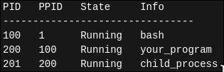
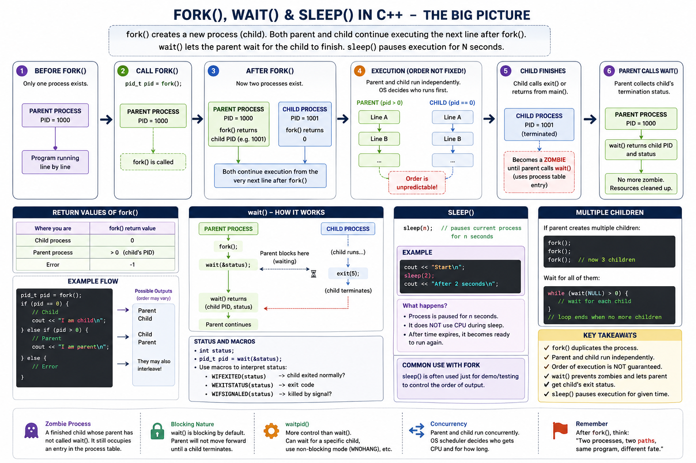
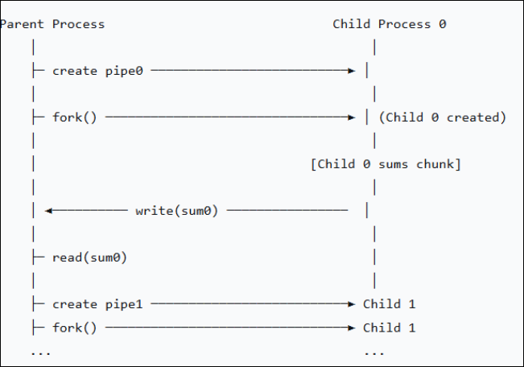

# IPC - Inter-Process Communication Using fork() and Pipes

# Problem 

In this problem, you will explore process creation, inter-process communication (IPC), and parallel algorithm design by implementing a parallel sum calculator. The problem is deceptively simple: given a large array (vector) of floating-point numbers, compute the total sum. However, instead of computing the sum sequentially in a single loop, you will divide the work among multiple child processes, each summing a portion of the array in parallel.

     This problem touches on core operating system concepts including:
        ◦ Process creation and management (fork())
        ◦ Process synchronization (wait())
        ◦ Inter-process communication (pipes)
        ◦ Resource management (file descriptors)
        ◦ Process termination and cleanup

# Concepts

## Process vs Thread
### Process

- Has its **own memory space** (address space): **Address space** is basically the **range of memory addresses a program (process) is allowed to use**.
- 👉 It’s like each process thinks it owns the whole memory, even though the OS is managing everything behind the scenes.
- Own resources (files, variables, heap, etc.)
- Completely **isolated** from other processes
- Communication between processes is **slower** (uses IPC like pipes, sockets)

👉 Example: Running Chrome and Spotify — each is a separate process.


### Threads

A **thread** is a smaller unit of execution **inside a process**.


- Shares the **same memory** with other threads in the same process
- Has its own stack and registers
- **Lightweight** compared to processes
- Communication is **fast** (shared memory)

👉 Example: A browser tab loadingmages, scripts,  iand UI simultaneously — using threads.


## Difference

| Feature       | Process 🧠                 | Thread 🧵                       |
| ------------- | -------------------------- | ------------------------------- |
| Memory        | Separate memory            | Shared memory                   |
| Isolation     | Strong (safe)              | Weak (can affect each other)    |
| Communication | Slow (IPC)                 | Fast (shared data)              |
| Creation cost | Expensive                  | Cheap                           |
| Crash impact  | One process crash ≠ others | One thread crash can affect all |


## fork, wait and sleep 

#### What is a process table  ?

The kernel keeps a big data structure (conceptually a table):



Each entry = one process

🔹 What’s stored per process?

Each process has a structure (in Linux it's like task_struct) that includes:
```
PID → Process ID (unique)

PPID → Parent Process ID

State → running / sleeping / zombie

Registers / CPU state

Memory info

Open files

List of children
```



## fork
* It's a system call (function), that creates a new process.
```C++
pid_t pid = fork();
```

→ The OS creates a child process.

→ It will executes after the fork() line, how ? the new process will copy the parent process memory space (stack, heap, Global/ static var, fd), by using a COW method (copy on write) .

* **Initially**: 
Parent and child share the same physical memory pages.
* **Only when one modifies memory**: The kernel creates a separate copy for that process.

So:

- The original process → called the parent

- The newly created process → called the child

>It's not guaranteed who will run first.


> Number of processes = **2 ^ n**, n = number of fork() in this code.

> Not checking fork() return value → Unpredictable behavior

## Wait 
wait() makes a parent process block until one of its child processes terminates, and then collects its exit status.

In other words suspends a parent process until a child finishes.

* It's useful because: 
  1) Synchronization:
        Parent waits for children to finish before continuing.

  2) Cleanup: (VERY important)
Removes zombie processes
Frees kernel resources
```C++

int main() {
  pid_t pid = fork();

  if (pid == 0) {
    std::cout << "Child running\n";
    sleep(2); // simulate work
    std::cout << "Child done\n";
  } else {
    std::cout << "Parent waiting...\n";
    wait(NULL); // wait for child to finish
    std::cout << "Parent resumes after child\n";
  }

  return 0;
}

```

What really happens (conceptually)

* When a process calls:

  ` wait(NULL);`

* The kernel already knows for each process its children (using the process table)
Checks:

  * Do I have any children?

    - ❌ No → return -1

    - ✅ Yes:

        If one already exited → return immediately


* You can make it wait for all children
```C++
while (wait(NULL) > 0);
```

> Not waiting for children → Zombie processes consume system resources

#### ⚠️ What happens if parent does NOT call wait()?

❌ 1. Zombie processes appear

* Child finishes → becomes zombie:

* Child: finished ❌ (still in process table)

If many children:

* You get many zombies
System resources get wasted


## The Challenge: Communication Between Processes (pipes)
How do child processes send their back to the parent?

Unlike threads, processes do not share memory space. Each process has its own private address space, so a child cannot simply write to a variable in the parent.

-> This is where **pipes** come in. A pipe is a unidirectional communication channel (one way only), that allows data to flow from one process to another. Think of it as a virtual tube:

  • One process **writes** data into one end of the tube, `write()`

  • Another process **reads** data from the other end, `read()`



* Pipes should be made before fork()? 
  
  Because to make it shareable between them, we must make it before.


* Pipes is a one way communication between `parent -> child`, if we need otherwise we must open another pipe `child -> parent`.
```C++
buffer[1] ──> [ KERNEL PIPE BUFFER ] ──> buffer[0]
```

```
Process FD table        Kernel space

pipes[0] ─────────────► [ PIPE OBJECT ] ◄───────────── pipes[1]
   (read end)              (buffer)                     (write end)
```


### Questions 
#### In pipes Why can't we do buffer[3] or more?

Because:

The kernel only returns two file descriptors
There are only two roles:
read
write

If you do:

```C++
int buffer[3];
pipe(buffer);
```
👉 The kernel will:

`fill buffer[0] and buffer[1],
ignore buffer[2] completely`.

#### How does buffer[1] used for write and buffer[0] for read 
* It’s defined behavior of the Unix API.

When you call: 
```C++
int buffer[2];
pipe(buffer)
```
    
The system guarantees: 

* `buffer[0]` -> read end 
* buffer[1] -> write end


#### How does pipes fits with fork() 

* After fork():
  
  * Both parent and child inherit both file descriptors.
  * So each process must close the end it doesn’t use.

Child:
```C++
close(pipes[1]); // doesn’t write
read(pipes[0], buffer, sizeof(buffer));
```

> A read() returns EOF (0) only when ALL write ends of the pipe are closed.

Parent: 
```C++
close(pipes[0]); // doesn’t read
write(pipes[1], msg, strlen(msg) + 1);
```


> Forgetting to close pipe end -> Process hangs forever waiting for data.

>Using pipes after closing them → Results in "bad file descriptor" errors


#### Why do we need to **close** unused pipe ends in both parent and child processes? What would happen if we didn't close them 
> read() returns 0 (EOF) only when pipe is empty and all write ends (from all processes in the program) are closed.

If you don’t close unused write ends:
The kernel sees: “there is still a writer alive”
So it assumes more data might come
👉 read() will block instead of returning EOF
Result:

Programs that read in a loop can **hang forever**


```C++
while (read(fd, buf, size) > 0) {
    // process data
}
/*

If any process (parent or child) still has the write end open:

read() never gets EOF
Loop never ends → 💥 hang
*/
```

Also:

* Each process inherits both ends after fork().

* If you don’t close:

  * A “reader” process still has a write end
  * A “writer” process still has a read end

This can cause:

- Confusing bugs.
- Hard-to-debug behavior.
- Incorrect assumptions about who is communicating.

#### How many possible cases of read() in pipes:

1) Data is already available,
read() returns immediately
You get the data .

2) No data yet, but at least one process has the write fd.
* `read()`: blocks (waits) for other writes to finish (close).
*  Blocking here comes from `read()` itself, not from `wait()` or `sleep()`.

3) No data and no writers left.
* `read()` returns 0 -> EOF

4) There exist data but some processes still has the `write()` fd for the pipe -> return the available data and no blocking will happen unless you call the `read()` again and other processes still has `writer()` fd.

> Pipe works as a FIFO queue (First-In First-Out), write() data on top of the queue, read() remove from the top.

> `read()` removes data: reading consumes (removes) the data from the pipe


#### If read() do blocking, why I need to use wait () ?

* They are used for different purposes :

| Function | Waits for…                     |
| -------- | ------------------------------ |
| `read()` | Block if empty and at least one write() still open. |
| `wait()` | Block if there is a **child process still** |

Getting the data ≠ the child has fully finished.
